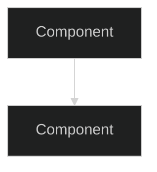

# Documentation Protocol

> Rules for how Represent project documentation is maintained.
> All contributors (human and AI) must follow these rules.
> Adapted from ORO `DOCS-PROTOCOL.md` and the Notion Bootstrap Architect doctrine.

Represent is the **root workspace for all LLM-based visual representation projects** under waremoto (lives at `D:/ware/represent`, repo: <https://github.com/Jlabarca/represent>). It hosts multiple sub-projects that ingest source code and output artistic visual representations (dependency graphs, creatures, cities, blueprints, animated minimaps, etc.). All sub-projects share two locked architectural commitments:

1. **Ghost AI backend** — LLM calls go through Ghost's AI pipeline, not direct provider SDKs.
2. **Embeddability first** — every tool ships to web, VSCode, JetBrains, desktop, mobile, CLI, and library. The core is headless; surfaces are thin shells.

This protocol exists to keep the docs strict, LLM-ingestible, and visually standardized as the workspace explores many parallel POCs and surface targets.

---

## Document Hierarchy

```text
docs/
├── CONTEXT.md                 ← THE living doc (state, decisions, next steps)
├── TODO.md                    ← Active sprint task tracker (checkbox items)
├── BACKLOG.md                 ← Non-blocking ideas, future work, deferred items
├── LOGBOOK.md                 ← Append-only session history
├── DOCS-PROTOCOL.md           ← This file (rules)
├── README.md                  ← Index with links to all docs
│
├── reference/                 ← System deep-dives (CURRENT implementation state)
├── research/                  ← POCs, spikes, studies (POSSIBLE future state)
├── ingestion/                 ← LLM ingestion strategies, annotated trees, prompts
├── visual-spec/               ← Art direction clusters (creature, city, actor, etc.)
├── guides/                    ← Practical how-to guides
├── troubleshooting/           ← Bug fix patterns and pitfalls
└── legacy/                    ← Archived superseded docs
```

---

## Rules

### Rule 1: CONTEXT.md is the Single Source of Truth

`CONTEXT.md` contains:
- Current project state (what's built, what's broken)
- Architecture decisions (locked choices with rationale)
- Milestone status (what's done, what's next)
- Implementation timeline (critical path)
- Current sprint (active work)

**When project state changes, update CONTEXT.md FIRST.** Reference docs update only when the system they describe changes (not when milestones shift).

### Rule 2: Root Companion Documents

CONTEXT.md is supported by companion docs that live at the `docs/` root alongside it:

| Root Doc   | Purpose                                  | Rules                       |
|------------|------------------------------------------|-----------------------------|
| **TODO.md** | Active sprint tasks with `[x]` checkboxes | Tracks current sprint only. Completed sprints roll up into CONTEXT.md "Completed" section. Reset per sprint cycle. |
| **BACKLOG.md** | Non-blocking issues, ideas, deferred work | Items here are NOT on the critical path. When an item becomes active, move it to TODO.md. Mark resolved items with `~~strikethrough~~` + date + one-line resolution. |
| **LOGBOOK.md** | Append-only session history | Each session appends: date, accomplishments, decisions, blockers, next steps. Never edit previous entries. |

CONTEXT.md = **strategic view** (where are we, where are we going).
TODO.md = **tactical view** (checkbox by checkbox).
BACKLOG.md = **parking lot** (not now, but don't forget).

### Rule 3: Research vs Reference — the Doc Lifecycle


**research/** = "How might we do X?" — proposals, POC designs, alternatives, benchmarks. NOT yet implemented.

**reference/** = "How does X work RIGHT NOW?" — current implementation, with code paths, file links, diagrams. The truth about **what exists in the codebase today**.

**Lifecycle:**
1. **Idea stage** → write in `research/` with alternatives, pros/cons, benchmarks
2. **Accepted** → add to CONTEXT.md "Current Sprint", create tasks in TODO.md
3. **Implemented** → create or update `reference/` doc describing the implementation. The research doc either:
   - Gets archived to `legacy/` (if fully superseded)
   - Stays in `research/` with a note: `> Partially implemented. See reference/x.md for current state.`
4. **Replaced** → old reference doc moves to `legacy/`, new one takes its place

### Rule 4: Reference Docs Don't Track Status

Reference docs explain HOW systems work. They do NOT contain:
- Milestone percentages (goes in CONTEXT.md)
- TODO lists (goes in TODO.md or BACKLOG.md)
- Session logs (goes in LOGBOOK.md)
- Progress tracking (goes in CONTEXT.md)

Use `<!-- CURRENT -->` and `<!-- IMPROVEMENT -->` tags to distinguish implemented vs planned sections within reference docs.

### Rule 5: Append & Deprecate, Never Destroy

Never delete historical bootstrapping ideas or previous architectural iterations. Represent will explore many dead-end POCs — they are valuable as a thinking trail, not waste.

When a project's direction changes, mark the outdated section:

```markdown
> [!WARNING]
> **DEPRECATED** — See [link to new section](#new-section)
> Reason: <one-line why>
> Date: YYYY-MM-DD
```

Then append the new notes below the marker. Never in-place rewrite a superseded idea.

If an entire file is superseded, move it to `legacy/` instead of deleting it, and add a one-line pointer at the top to the replacement.

### Rule 6: Atomic POC Structure — Four Mandatory Sections

Every new entry in `research/` (POCs, bootstrapping attempts, visualization spikes) MUST contain these four sections, in this order:

1. **System Intent** — What is the software being visualized? What scale and domain?
2. **Ingestion Vector** — What specific files, extensions, or directory trees will the LLM tool study? (See Rule 8.)
3. **Visualization Spec** — What is the artistic / visual output goal? (dependency graph, creature, city, blueprint, animation, 3D mesh, etc.)
4. **Bootstrapping Steps** — Actionable, technical next steps.

Two additional sections are **strongly recommended** (and required once the POC leaves pure brainstorming):

5. **Ghost AI Plan** — Which Ghost protocol(s) does this POC consume? What's the prompt cache-key granularity? What's the fallback chain? (See `Ghost/docs/reference/ai-system.md` and `Ghost/docs/reference/protocols.md`.)
6. **Embeddability Plan** — How does this POC reach each surface in the embeddability table (web / VSCode / JetBrains / desktop / mobile / CLI / library)? What lives in the headless core vs in each surface shell?

If the user's input is missing any of the four mandatory sections, **stop and prompt them for the missing protocol requirements before finalizing the entry.** Do not invent answers to fill the gaps.

### Rule 7: Visual Standardization via Mermaid

All complex system flows, data pipelines, and component relationships MUST be documented using `mermaid` diagrams. Precision is the priority; diagrams must be structurally sound and visually clean. Always dark-themed:



Mermaid node text with parentheses or special characters must be wrapped in double quotes (`A["Foo (bar)"]`). Use `<br/>` for line breaks inside node labels — never `\n`.

### Rule 8: Directory Tree Standard — Ingestion Vectors

When outlining ingestion targets or project structures, strictly use ASCII tree formatting inside fenced code blocks. Crucial nodes MUST be annotated with inline instructions for future LLM ingestion:

```text
src/
├── Core/              # @LLM-ENTRY: start here — domain roots
├── Services/          # @LLM-TARGET: extract relationships, DI edges
│   ├── NetService.cs  # @LLM-TARGET: primary runtime path
│   └── Mocks/         # @LLM-IGNORE: test doubles, skip
├── UI/                # @LLM-DECORATIVE: visualize as leaves, not nodes
└── gen/               # @LLM-IGNORE: generated code
```

**Supported annotations:**

| Tag | Meaning |
|---|---|
| `@LLM-ENTRY` | Start the ingestion walk here |
| `@LLM-TARGET` | Primary semantic value — parse deeply |
| `@LLM-DECORATIVE` | Render visually but skip semantic parsing |
| `@LLM-IGNORE` | No semantic value — skip entirely |

Every POC in `research/` must include at least one annotated tree in its **Ingestion Vector** section.

### Rule 9: Technical Doc Quality Standards

Reference and research docs MUST include (where they fit for clearer explanations):

**Code snippets** — real code from the codebase, not pseudocode:
```csharp
// From src/Represent.Core/Ingestion/TreeWalker.cs:42
public async Task<IngestionTree> WalkAsync(string root, CancellationToken ct)
{
    var nodes = await _scanner.ScanAsync(root, ct);
    return _annotator.Annotate(nodes);
}
```

**File path links** — clickable references to source:
- `[TreeWalker.cs:42](../src/Represent.Core/Ingestion/TreeWalker.cs#L42)`
- Use relative paths from the `docs/` folder

**Mermaid diagrams** — dark themed, per Rule 7.

**Annotated ingestion trees** — per Rule 8, at least one in every `research/` POC.

**Visualization samples** — for `visual-spec/` and research POCs, include screenshots, mockups, or generated images. A visualization doc without images is incomplete.

Not every section needs all of these. Use judgment — the goal is that a reader can **find the code**, **see the relationships**, AND **see the visual output** without guessing.

### Rule 10: One Update Point Per Change

When something changes (e.g., "Creature-mode POC now renders"):
1. Update `CONTEXT.md` — milestone table, current sprint, timeline
2. Update `TODO.md` — check off the task
3. Append to `LOGBOOK.md` — what happened this session
4. Update the relevant reference doc ONLY IF the system description changed (not just its status)

Bad: updating creature.md, ingestion.md, architecture.md, CONTEXT.md, and DOCS-AUDIT.md for the same milestone.
Good: CONTEXT.md + TODO.md checkbox + LOGBOOK.md entry.

### Rule 11: Architecture Decisions Live in CONTEXT.md

Architecture decisions (why we chose a specific LLM, why SVG over WebGL, why per-file vs per-module granularity, etc.) are recorded in the "Key Architecture Decisions (Locked)" table in CONTEXT.md. No separate `plan/` or `adr/` folder — decisions are inline with the living doc.

### Rule 12: README.md is the Index

`docs/README.md` is a directory listing with one-line descriptions. It links to CONTEXT.md as the entry point. Update it whenever docs are added, moved, or deleted.

### Rule 13: Root is ALL CAPS Only

The `docs/` root contains **only ALL CAPS filenames** (CONTEXT.md, TODO.md, BACKLOG.md, LOGBOOK.md, README.md, DOCS-PROTOCOL.md). Everything else lives in a categorized subfolder.

**Exception: `POC-IMPL.md` living tracker docs.** See Rule 15 below.

### Rule 14: Topic Cluster Subfolders

When a theme accumulates 3+ related docs, create a topic-cluster subfolder. Examples expected for Represent:

```
docs/
├── visual-spec/    ← creature-mode, city-mode, actor-mode, blueprint-mode, etc.
├── ingestion/      ← git-walk, ast-parse, ide-index, embedding strategies
├── prompts/        ← prompt templates per output style
└── features/       ← deep-dives on specific renderer features
```

```text
docs/
├── visual-spec/    ← creature-mode, city-mode, actor-mode, blueprint-mode, etc.
├── ingestion/      ← git-walk, ast-parse, ide-index, embedding strategies
├── prompts/        ← prompt templates per output style
└── features/       ← deep-dives on specific renderer features
```

Topic clusters are **not** the same as `reference/`. Reference docs are **system descriptions** (how the ingestion pipeline works). Topic clusters are **deep explorations** of a domain that need their own namespace.

Each topic cluster should have its own entry-point doc noted in README.md.

### Rule 15: POC-IMPL.md Living Tracker Pattern

When a POC moves from research to active multi-session implementation with bug tracking and phased delivery, create a `{POC}-IMPL.md` at the `docs/` root. This is the project's standard pattern for tracking complex POCs from inception through completion.

**When to create one:** Ask yourself — does this POC have:
- Multiple implementation phases (not just one PR)?
- Known bugs or test plans that need tracking across sessions?
- Enough complexity that a new AI session needs a dedicated continuation prompt?

If yes to 2+, create a `{POC}-IMPL.md`. If it's a single-session task, just use TODO.md.

**Naming:** `{POC}-IMPL.md` — ALL CAPS, hyphenated. Examples: `CREATURE-IMPL.md`, `GOURCE-MODE-IMPL.md`, `MINIMAP-IMPL.md`.

**Required structure:**

```markdown
# POC Name — Implementation Tracker

> Living design+status doc for {poc}.
> See `research/{poc}.md` for the original POC brief.
> Follows DOCS-PROTOCOL.md Rule 15.
> Updated: {date}

## AI Continuation Prompt
{Context files to read, implementation files to read, current state summary.
 This section exists so a fresh AI session can pick up where the last left off.}

## System Intent
{What software is being visualized, what scale, what domain. Per Rule 6.}

## Ingestion Vector
{Annotated tree per Rule 8. The exact files the pipeline consumes.}

## Visualization Spec
{Artistic output goal — creature, city, blueprint, etc. Include mockups.}

## Architecture
{Key design decisions, diagrams, constraints.}

## Current State ({date})
{What's working, what's not. Plain prose, not checkboxes.}

## Known Bugs
{BUG.N format with symptom, suspected cause, debug approach.}

## What Needs Testing
{TEST.N format with step-by-step test plans.}

## Implementation Status
{Table: Phase | State | Model | Description}

## Checklist
{Checkbox items grouped by phase. Use POC.PHASE.N ID format.}

## Key Files Reference
{Table: File | Purpose}

## Architecture Notes
{Why decisions were made — the non-obvious stuff future sessions need.}
```

**Lifecycle:**

1. **Create** when the POC moves from `research/` to active implementation
2. **Reference** from CONTEXT.md "Current Sprint" and TODO.md
3. **Update** each session (especially: Current State date, checklist checkboxes, known bugs)
4. **Convert** to `reference/` doc when the POC is complete — strip the tracking sections (checklists, known bugs, test plans), keep System Intent + Ingestion Vector + Visualization Spec + Architecture + Key Files

---

## How to Add a New POC

When the user proposes a new visualization idea or bootstrapping note, use this workflow:

1. **Check Rule 6** — does the input cover System Intent, Ingestion Vector, Visualization Spec, and Bootstrapping Steps? If any are missing, stop and prompt the user.
2. **Create `docs/research/{poc-slug}.md`** with the four mandatory sections.
3. **Include at least one annotated ingestion tree** per Rule 8.
4. **Include a visual mockup or reference image** where possible.
5. **Update `docs/CONTEXT.md`** — add a line under "Active Research".
6. **Append to `docs/LOGBOOK.md`** — record the POC creation.
7. **Update `docs/README.md`** — add to the research index.

If the POC gets promoted to implementation, follow Rule 15 to create a `{POC}-IMPL.md`.

---

## What Goes Where

| Question | Document |
|----------|----------|
| "What milestone are we on?" | CONTEXT.md |
| "What am I doing right now?" | TODO.md |
| "What's deferred / not urgent?" | BACKLOG.md |
| "How does system X work?" | reference/x.md |
| "How might we build POC Y?" | research/y.md |
| "What happened last session?" | LOGBOOK.md |
| "Why did we choose X over Y?" | CONTEXT.md → Architecture Decisions table |
| "What's the next task?" | TODO.md (current sprint) or CONTEXT.md → Current Sprint |
| "What ingestion tree does POC X consume?" | research/x.md → Ingestion Vector |
| "What is the visual output goal for POC X?" | research/x.md → Visualization Spec |
| "Where's the old design for X?" | legacy/x.md |
| "What prompt template does X use?" | prompts/x.md (once the cluster exists) |
| "Something broke, what's the pattern?" | troubleshooting/x.md |
| "How do I do X step by step?" | guides/x.md |

---

## When Adding a New Doc — Decision Tree

1. Is it a living status/decision doc? → Probably belongs in CONTEXT.md, not a new file
2. Is it an active sprint task list? → TODO.md
3. Is it a deferred idea or non-blocking issue? → BACKLOG.md
4. Is it a system deep-dive about current implementation? → `reference/`
5. Is it a proposal or POC study about a future visualization? → `research/` (and follow Rule 6)
6. Is it a temporary migration/spike plan? → `research/` with a "temporary" note, or a `{POC}-IMPL.md` if it's active
7. Is it an architecture decision? → CONTEXT.md "Architecture Decisions" table
8. Is it a how-to guide? → `guides/`
9. Is it a bug pattern or pitfall? → `troubleshooting/`
10. Is it art direction / a visual mode concept? → `visual-spec/` cluster
11. Is it an LLM prompt template? → `prompts/` cluster
12. Does it belong to a domain with 3+ existing docs? → topic cluster subfolder
13. **Never** add a lowercase `.md` to the `docs/` root.

---

## Validation Tasks

These are prompts you can run periodically to keep docs healthy.

### Task: Validate Reference Docs (sync check)

```
Read docs/DOCS-PROTOCOL.md and docs/README.md.
Then for each file in docs/reference/:
  1. Check the "Updated:" date — flag if older than 30 days
  2. Check file paths and code snippets — verify they still exist in the codebase
  3. Check for status tracking (TODO lists, milestone %, "next steps") — these belong in CONTEXT.md
  4. Check for mermaid diagrams and code snippets — flag reference docs that have neither
  5. Check <!-- CURRENT --> and <!-- IMPROVEMENT --> tags are present and correct

Output a table:
| File | Last Updated | Stale Paths | Status Leak | Has Diagrams | Has Code | Action Needed |
```

### Task: Validate Research Docs (Rule 6 compliance)

```
Read docs/DOCS-PROTOCOL.md.
Then for each file in docs/research/:
  1. Verify all four mandatory sections are present:
     - System Intent
     - Ingestion Vector (with at least one annotated tree per Rule 8)
     - Visualization Spec
     - Bootstrapping Steps
  2. Flag missing sections
  3. Flag ingestion trees without any @LLM-* annotations
  4. Flag visualization specs without any mockup, image, or concrete description

Output a table:
| File | Intent | Ingestion | Visual | Steps | Annotated Tree | Has Mockup |
```

### Task: Validate Docs Hygiene

```
Read docs/DOCS-PROTOCOL.md, then audit the full docs/ folder:
  1. Root files: verify ALL CAPS only (flag lowercase .md at root, except {POC}-IMPL.md)
  2. README.md: verify every non-legacy .md file is listed (flag orphans)
  3. research/: flag docs that describe already-implemented POCs (should move to reference/ or legacy/)
  4. legacy/: scan for files that are still referenced by non-legacy docs (stale links)
  5. CONTEXT.md: verify "Current Sprint" items have matching TODO.md entries
  6. TODO.md: verify no completed sprint sections older than 2 sprints
  7. BACKLOG.md: flag items marked done but not strikethrough
  8. reference/: flag files with TODO lists, milestone %, or progress tracking (Rule 4 violation)
  9. research/: flag files missing any of the four mandatory sections (Rule 6 violation)

Output a report with violations grouped by rule number and suggested fixes.
```
